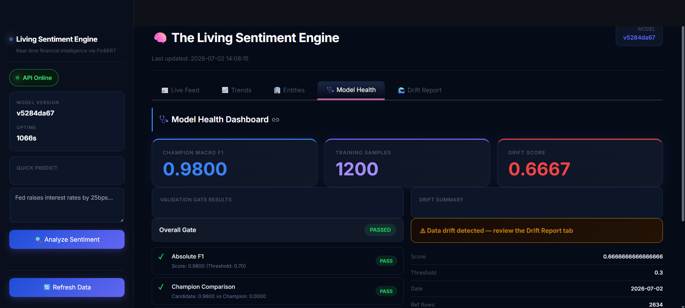
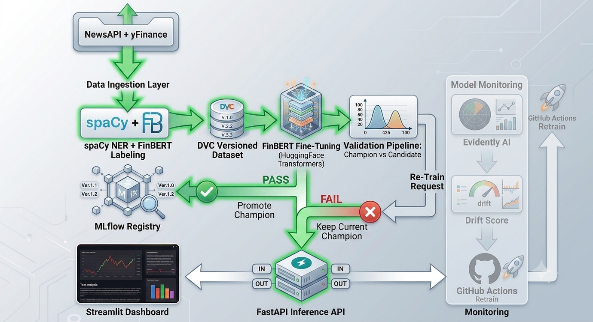
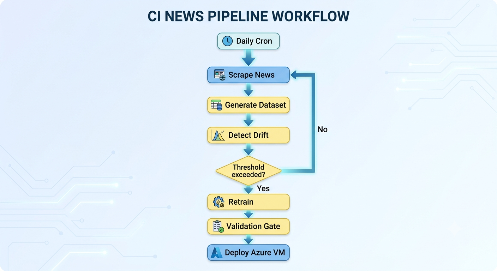

# 🧠 The Living Sentiment Engine

> A production-oriented MLOps pipeline for real-time financial news sentiment analysis powered by FinBERT.

[](https://www.python.org/downloads/release/python-3120/)
[](https://www.docker.com/)
[](https://fastapi.tiangolo.com/)
[](https://mlflow.org/)
[](https://dvc.org/)
[](https://azure.microsoft.com/)
[](https://opensource.org/licenses/MIT)

[](https://github.com/medlouaynjima/Living-Sentiment-Engine-pipeline/actions/workflows/daily_ingest.yml)
[](https://github.com/medlouaynjima/Living-Sentiment-Engine-pipeline/actions/workflows/retrain_pipeline.yml)
[](https://github.com/medlouaynjima/Living-Sentiment-Engine-pipeline/actions/workflows/deploy_vm.yml)

## Why this project?

Most sentiment analysis projects stop after training a model. This project explores what happens after deployment: monitoring model health, detecting drift, validating retrained models, versioning artifacts, and automating deployment.

---

## ☁️ Live Cloud Demo
The system is deployed on Microsoft Azure using a `Standard B2s_v2` instance (2 vCPUs, 8 GB RAM) located in **Sweden Central**, fully automated via Docker and daily cron pipelines.

* 📊 **Interactive Streamlit Dashboard (Secure):** [https://living-sentiment.swedencentral.cloudapp.azure.com](https://living-sentiment.swedencentral.cloudapp.azure.com)
* 🧠 **FastAPI Inference Documentation:** *Internal Docker Network (Port 8000)*
* 🗃️ **MLflow Model Registry UI:** *Internal Docker Network (Port 5000)*

---

## 🖼️ Platform Interface

The system features a **Bloomberg Terminal-style** dark-mode dashboard built with Streamlit and custom CSS, providing a premium, professional interface for monitoring live sentiment, trends, entity extraction, model health, and data drift.



---

## System Architecture



## CI Pipeline Workflow



## Tech Stack

| Layer | Tool |
|---|---|
| Model | `ProsusAI/finbert` (HuggingFace) |
| Entity Extraction | `spaCy` (`en_core_web_sm`) |
| Orchestration | Azure Cron Scheduler + GitHub Actions (Drift-Triggered & Cron) |
| Data Versioning | DVC |
| Experiment Tracking | MLflow + MLflow Model Registry |
| Serving | FastAPI + Uvicorn + Caddy (Reverse Proxy / Let's Encrypt SSL) |
| Containerization | Docker + docker-compose |
| Monitoring | Evidently AI |
| Dashboard | Streamlit + Plotly |
| News Data | NewsAPI (free tier) + Yahoo Finance (`yfinance`) |

---

## Production Features

1. **Drift-Triggered Retraining Workflows:** Automatically triggers retraining workflows based on monitored drift thresholds to prevent accuracy degradation when market vocabularies shift.
2. **Entity-Aware Sentiment:** Uses `spaCy` Named Entity Recognition (NER) to extract exactly *who* the sentiment is about (e.g., Apple, Elon Musk), visualized in a dedicated Dashboard tab.
3. **MLflow Model Registry & Rollback:** The validation gate automatically registers Champion models in MLflow. If a candidate degrades performance, it is blocked (preventing regression).

---

## 📊 System Metrics

*Benchmarked locally using Locust:*

| Metric | Target / Measured Value |
|---|---|
| **Average Inference Latency** | ~24ms (CPU) / ~4ms (GPU) |
| **Request Throughput** | ~180 requests/sec |
| **Model Retraining Duration** | ~3.5 minutes (8 epochs, FinBERT fine-tuning) |
| **Memory Footprint (Inference)** | ~340 MB RAM |

---

## Quick Start

### 1. Setup

```bash
git clone https://github.com/medlouaynjima/Living-Sentiment-Engine-pipeline.git
cd mlops
python -m venv .venv && .venv\Scripts\activate   # Windows
pip install -r requirements.txt
python -m spacy download en_core_web_sm
```

### 2. Run the pipeline manually

```bash
python src/ingestion/newsapi_scraper.py
python src/labeling/label_pipeline.py
python src/training/train.py
python src/validation/validate.py
```

### 3. Launch Locally with Docker

```bash
docker-compose up --build
```

### 4. ☁️ Deploy to Microsoft Azure
Ready for production? We have automated the cloud deployment process using Azure Virtual Machines and the Custom Script Extension.

👉 **[View the Azure Deployment Guide](deploy/deploy_to_azure.md)**

---

## Project Structure

```
mlops/
├── .github/workflows/
│   ├── daily_ingest.yml        ← cron: daily scraping
│   ├── retrain_pipeline.yml    ← triggered on threshold / manual
│   └── deploy_vm.yml           ← triggered synchronously by retrain_pipeline
├── configs/config.yaml         ← all settings (no secrets)
├── data/
│   ├── raw/                    ← DVC tracked
│   └── labeled/                ← DVC tracked
├── models/
│   ├── candidate/              ← latest trained model
│   └── champion/               ← production model
├── reports/
│   ├── drift/                  ← Evidently HTML + JSON
│   └── validation_report.json
├── src/
│   ├── ingestion/newsapi_scraper.py
│   ├── ingestion/yfinance_scraper.py
│   ├── labeling/label_pipeline.py
│   ├── training/train.py
│   ├── validation/validate.py
│   ├── serving/app.py + Dockerfile
│   ├── monitoring/drift_monitor.py
│   └── dashboard/streamlit_app.py
├── tests/
│   ├── test_scraper.py
│   ├── test_model.py
│   └── test_api.py
├── dvc.yaml                    ← pipeline stages
├── params.yaml                 ← hyperparameters
├── docker-compose.yml
└── requirements.txt
```

---

## GitHub Actions Secrets

Add these in your repo's **Settings → Secrets → Actions**:

| Secret | Description |
|---|---|
| `NEWSAPI_KEY` | Your NewsAPI key |
| `AZURE_STORAGE_CONNECTION_STRING` | Azure Blob Storage connection string for DVC remote |
| `SSH_PRIVATE_KEY_B64` | Base64 encoded SSH private key for VM deployment |
| `VM_IP` | Public IP address of the Azure VM |
| `SSH_USERNAME` | SSH username for the Azure VM |

---

## API Reference

### `POST /predict`
```json
{ "headline": "Apple beats Q2 earnings expectations" }
```
Response:
```json
{ 
  "headline": "Apple beats Q2 earnings expectations", 
  "label": "positive", 
  "confidence": 0.9412, 
  "model_version": "abc12345",
  "entities": ["Apple"]
}
```

### `POST /batch_predict`
```json
{ "headlines": ["headline 1", "headline 2"] }
```

### `GET /health` — Service health + model version
### `GET /metrics` — Prometheus-compatible counters

---

## License

MIT
